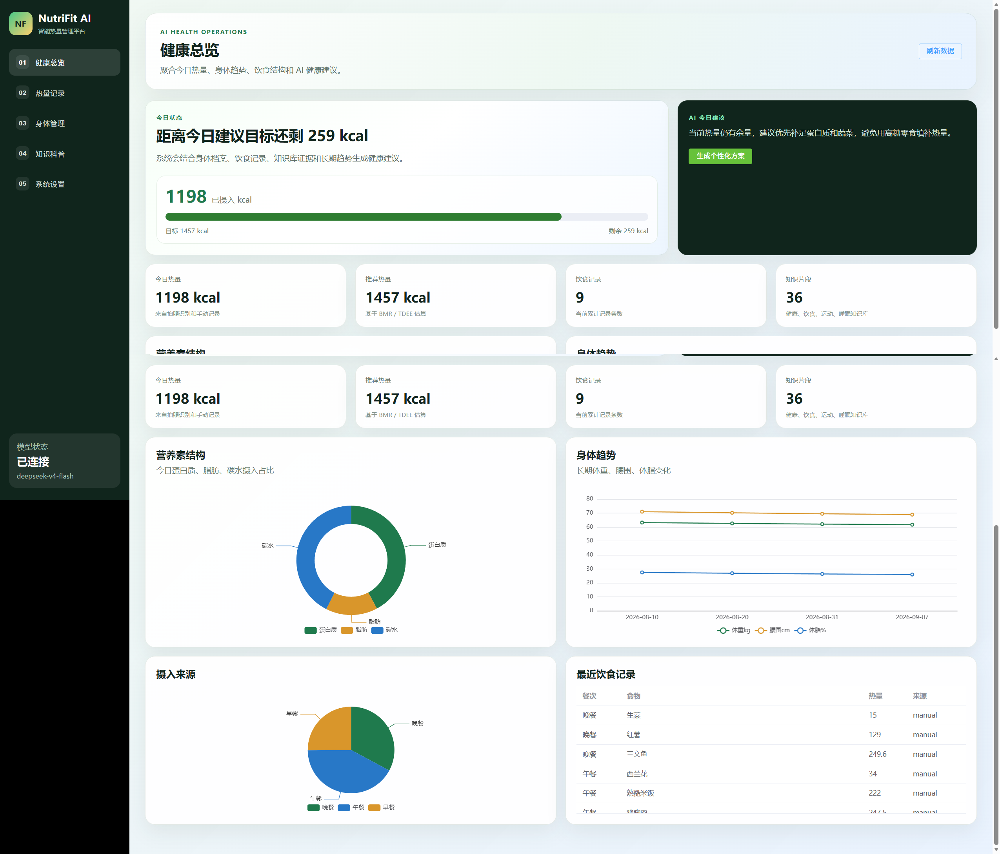
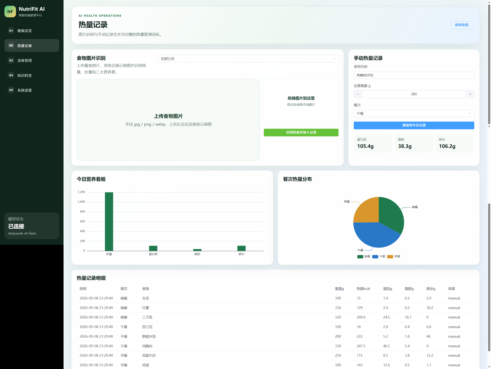
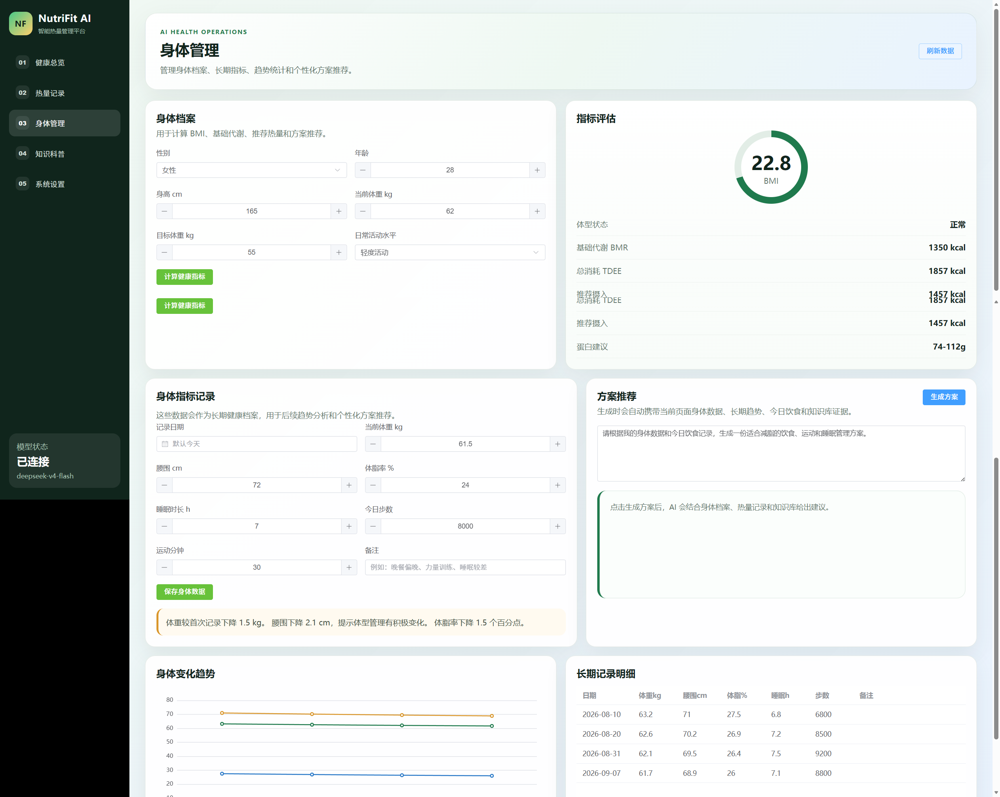

# NutriFit AI · 健康轻食营养顾问平台

> 面向个人用户的 AI 健康饮食助手：拍照记热量、AI 定制减脂方案、可追溯证据的知识问答，一个前后端分离的完整系统，免费、轻量、可私有部署。

## 项目简介

NutriFit AI 是一个集 **AI 图像识别、RAG 知识问答、多轮 Agent 方案生成、长期身体记忆** 于一体的健康轻食营养顾问平台。用户通过拍照或手动记录饮食，平台自动估算热量与营养素；结合身体档案与长期趋势，AI 生成个性化减脂方案；所有健康建议基于本地知识库生成并附带可复核的证据来源。

项目特点：

- **免费可交付**：面向个人用户，无需数据库，JSON 文件存储即可运行，部署门槛极低
- **AI 原生**：对话（DeepSeek）+ 视觉（Qwen-VL）双模型，全链路 SSE 流式输出
- **合规设计**：Agent 反思层拦截医疗化表述、自动附加健康风险提示
- **前端体验**：打字机流式渲染、执行过程可视化追踪、功能开关运行时热切换

## 核心功能（5 大模块）

| 模块 | 功能 |
|---|---|
| 01 健康总览 | 聚合今日热量、身体趋势图表、饮食结构分析、AI 健康建议 |
| 02 热量记录 | 拍照识别（视觉模型）+ 手动记录双通道，热量/蛋白质/脂肪/碳水统计，明细管理 |
| 03 身体管理 | 身体档案（BMR/TDEE/目标热量计算）、长期指标趋势统计、个性化方案推荐（Agent 多轮对话） |
| 04 知识科普 | 基于本地知识库的 RAG 问答，答案附带证据引用、可点击复核 |
| 05 系统设置 | 模型连接状态、4 个功能开关（图片识别/Agent 追踪/长期记忆/风险提示）运行时热切换 |

## 界面截图

**健康总览**：聚合今日热量、身体趋势、饮食结构与 AI 健康建议。



**热量记录**：拍照识别 + 手动记录，营养素统计与明细管理。



**身体管理**：身体档案、长期指标趋势与个性化方案推荐。



## 技术架构

```
┌───────────────────┐   HTTP / SSE   ┌──────────────────────────────────┐
│  Vue 3 + TS SPA    │ ─────────────▶ │  FastAPI 后端（8008）             │
│  Element Plus      │                │  ├─ RAG 服务：混合检索 + 生成      │
│  ECharts 可视化     │ ◀───────────── │  ├─ Agent：规划→执行→反思 + 记忆   │
│  Pinia 状态管理     │                │  ├─ 视觉服务：食物拍照识别         │
└───────────────────┘                │  └─ 档案 / 记录 / 配置服务         │
                                     └───────────┬──────────────────────┘
                                                 │ OpenAI 兼容 SDK
                                     ┌───────────▼───────────┐
                                     │ DeepSeek（对话）        │
                                     │ Qwen-VL（视觉识别）     │
                                     └───────────────────────┘
数据层：JSON 文件存储（饮食记录 / 身体档案 / 会话记忆）+ data/ 本地知识库（Markdown + CSV）
```

**AI 流水线**：用户问题 → 意图识别 → Agent 规划（Plan）→ 工具执行（知识检索 / 长期身体记忆，ReAct）→ 大模型流式生成（打字机输出）→ 反思层合规处理（违禁表述替换 + 风险提示）→ 会话记忆落盘。

## 技术栈

| 层 | 技术 | 说明 |
|---|---|---|
| 前端框架 | Vue 3.5 · TypeScript 5 · Vite 7 | Composition API + `<script setup>`，vite proxy 打通前后端 |
| UI / 状态 / 图表 | Element Plus 2.12 · Pinia 3 · ECharts 6 | 组件库、全局状态、趋势可视化 |
| 后端框架 | Python 3.10 · FastAPI · Uvicorn | 22 个 REST + SSE 接口，Pydantic 校验 |
| 对话模型 | DeepSeek（deepseek-v4-flash） | OpenAI 兼容 SDK 调用 |
| 视觉模型 | 通义千问 Qwen-VL（qwen-vl-plus） | 食物拍照识别 |
| 检索方案 | TF-IDF 向量检索 + BM25 关键词检索 | 0.65/0.35 加权融合，chunk 520 / overlap 90 |
| 流式输出 | SSE（Server-Sent Events） | stage / delta / done / error 事件协议 |
| 存储 | JSON 文件存储 | 零数据库依赖，个人使用场景轻量可迁移 |

## 目录结构

```
NutriFit-AI/
├── backend/
│   ├── app/
│   │   ├── main.py             # FastAPI 入口（22 个接口）
│   │   ├── config.py           # 配置加载（环境变量 > config.yaml > 默认值）
│   │   ├── schemas.py          # Pydantic 请求 / 响应模型
│   │   └── services/           # 业务服务层
│   │       ├── rag.py          # RAG 混合检索 + 生成（含流式）
│   │       ├── agent.py        # 规划-执行-反思 Agent（含流式）
│   │       ├── vision.py       # 食物图片识别
│   │       ├── health.py       # BMR / TDEE / 目标热量计算
│   │       ├── food.py         # 食物库与热量记录
│   │       ├── memory.py       # 会话与记忆管理
│   │       ├── body_metrics.py # 身体指标长期趋势
│   │       ├── storage.py      # JSON 文件存储读写
│   │       └── sse.py          # SSE 事件编码
│   ├── config/
│   │   ├── config.example.yaml # 配置模板（可提交）
│   │   └── config.yaml         # 本地配置（含 API Key，不入库）
│   ├── .env.example            # 环境变量模板
│   └── requirements.txt        # 运行依赖（7 个）
├── data/
│   ├── food_database/          # 食物营养数据库（CSV，21 种常见食物）
│   ├── knowledge_base/         # 健康知识文档（Markdown，6 篇 → 36 个知识分块）
│   └── recipes/                # 减脂食谱
└── frontend/
    ├── src/
    │   ├── App.vue             # 页面与交互逻辑
    │   ├── api/client.ts       # API 客户端（含 SSE 流式消费）
    │   └── style.css           # 全局样式
    ├── vite.config.ts          # dev server + /api 代理
    └── package.json
```

## 快速开始

### 1. 后端（端口 8008）

```bash
cd backend
pip install -r requirements.txt
# 国内网络可加镜像：pip install -r requirements.txt -i https://pypi.tuna.tsinghua.edu.cn/simple

# 方式一：复制配置模板并填入 API Key
cp config/config.example.yaml config/config.yaml   # 编辑 config.yaml 填入 chat / vision 的 api_key

# 方式二：环境变量注入（Windows: set DEEPSEEK_API_KEY=xxx）
#   DEEPSEEK_API_KEY / DEEPSEEK_BASE_URL / NUTRIFIT_CHAT_MODEL
#   DASHSCOPE_API_KEY / DASHSCOPE_BASE_URL / NUTRIFIT_VISION_MODEL

uvicorn app.main:app --reload --port 8008
```

启动后 `storage/` 目录会自动创建；接口文档见 http://127.0.0.1:8008/docs 。

### 2. 前端（端口 5175）

```bash
cd frontend
npm install
npm run dev      # http://127.0.0.1:5175 ，/api 已代理到 8008
```

## API 概览（22 个接口）

| 分类 | 方法 | 路径 | 说明 |
|---|---|---|---|
| 总览 | GET | `/api/dashboard/summary` | 仪表盘聚合数据 |
| 健康档案 | POST | `/api/profile/calculate` | 计算 BMR / TDEE / 目标热量 |
| 热量记录 | GET | `/api/food/search` | 食物库搜索 |
| 热量记录 | POST | `/api/food/log` | 记录饮食（自动估算营养素） |
| 热量记录 | GET | `/api/food/records` | 饮食记录与当日汇总 |
| 图像识别 | POST | `/api/food/recognize` | 拍照识别食物与热量 |
| 知识问答 | POST | `/api/rag/retrieve` | 检索知识证据 |
| 知识问答 | POST | `/api/rag/chat` | RAG 问答（一次性返回） |
| 知识问答 | POST | `/api/rag/chat/stream` | RAG 问答（SSE 流式） |
| 智能方案 | POST | `/api/agent/chat` | Agent 方案对话（一次性返回） |
| 智能方案 | POST | `/api/agent/chat/stream` | Agent 方案对话（SSE 流式） |
| 会话 | POST | `/api/chat/session` | 新建会话 |
| 会话 | GET | `/api/chat/sessions` | 会话列表 |
| 会话 | GET | `/api/chat/history/{session_id}` | 会话历史 |
| 身体记忆 | POST | `/api/memory/body-metrics` | 记录身体指标 |
| 身体记忆 | GET | `/api/memory/body-metrics` | 指标与长期趋势 |
| 配置 | GET | `/api/config/public` | 公开配置（密钥脱敏） |
| 配置 | POST | `/api/config/features` | 功能开关运行时热切换 |
| 知识库 | GET | `/api/knowledge/stats` | 知识库统计 |
| 管理 | POST | `/api/admin/clear-food-records` | 清空饮食记录 |
| 管理 | POST | `/api/admin/clear-all-data` | 清空所有运行数据 |
| 系统 | GET | `/` | 服务信息 |

## 亮点设计

1. **混合检索 RAG**：TF-IDF 向量语义 + BM25 关键词双路检索加权融合，中文健康语料下兼顾语义相关性与关键词命中；生成回答附带证据来源，用户可复核，避免"一本正经地胡说"。
2. **三段式 Agent**：规划（Plan）→ 执行（ReAct）→ 反思（Reflection）。生成过程中把执行阶段实时推送给前端可视化；反思层负责合规：将"治疗"等医疗化表述替换为"辅助健康管理"，并自动附加就医提示。
3. **全链路 SSE 流式输出**：`stage / delta / done / error` 事件协议，前端打字机渲染 + 闪烁光标 + 答案区自动滚动；旧接口保留，向后兼容。
4. **长期身体记忆**：身体指标以时间序列落盘，Agent 回答方案时自动携带长期趋势与短期会话上下文，建议随身体变化动态调整。
5. **功能开关运行时热切换**：开关状态存于独立运行时文件，每次请求实时读取、改动即时生效；开关文件与含密钥的 `config.yaml` 分离，避免"改配置"误触密钥。
6. **零数据库轻量设计**：全部运行数据用 JSON 文件存储，克隆即用、备份即拷贝、无运维负担，契合个人使用与低维护部署场景。

## 合规与隐私

- 健康建议输出前经反思层合规处理，明确"不替代医生诊断"，医疗问题引导就医
- 上传图片按留存策略管理（默认 30 天），支持一键清空全部运行数据
- API Key 不进入代码仓库：`config.yaml` / `.env` 均在 `.gitignore` 中，仓库仅提供脱敏模板
- 日志对 API Key 脱敏，接口只返回 `has_chat_api_key` 布尔值

## 开源协议

本项目基于 [MIT License](LICENSE) 开源。

## 免责声明

本项目输出的饮食建议仅供健康科普参考，不构成医疗建议；特殊疾病、孕期或进食障碍人群请咨询医生或注册营养师。
